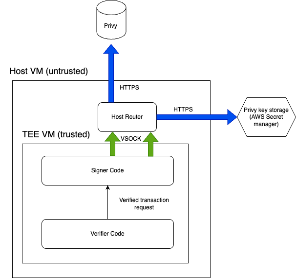
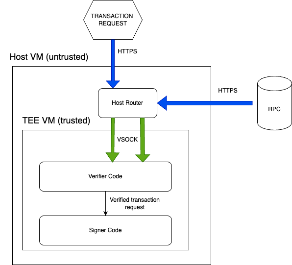

# verified-signer-service
This is a service that handles the signatures for transactions on behalf of users using privy's delegated signing (session keys).
In order to ensure that we do not maliciously sign transactions and our strategies follow a set of user-defined rules, we verify every signature request with a TEE. This way, we can manage the users money without committing any malicious signatures. The enclave repository will be open sourced.

It is broken down into 3 sections, common, enclave and host. In order to run them you may refer to their individual READMEs

### 1. Common 

This is a set of common libraries used by both the host and the enclave. These are not meant to be run as a service themselves. 

### 2. Enclave

This is the code that will be running inside the enclave. It consists of 2 logical parts, the privy signer and the transaction verifier. 

The privy signer is a service that sends transaction signature requests to the privy backend to sign after they have been verfied by the verifier. It does so through a secure HTTPS connection, which the host cannot intercept due to TLS encryption.

The transaction verifier verifies traits in the transaction to ensure that the transactions are safe and represent the users interests. These include safeguards to guard user funds. The verifier gets up to date information of onchain events through RPC feeds (in HTTPS)

More information and documentation for Enclave APIs can be found at the enclave's [README](/enclave/README.md).

### 3. Host
The host simply provides APIs Axals strategy backend to call. This allows for communication with the TEE as the host will proxy any requests to the backend via VSOCK. This is still a temporary solution, we will in future initiate the backend connection with HTTPs to ensure the host cannot see or tamper with any requests.

The API docs can be found at the host's [README](/host/README.md).
